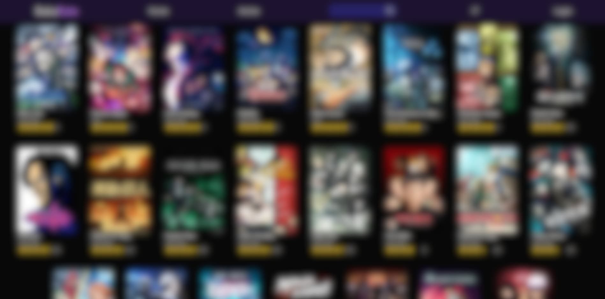

# BakaRate AnimeList
Before I even started my coding journey i always had my notebook with some rating on it ,So why not make it 
a website!! And thats why I made **BAKARATE**
A modern, interactive anime listing and rating web app built with React, TypeScript, and Tailwind CSS.



## 🚀 Features

- 🔍 **Search & Filter:** Instantly search and sort anime by title or rating.
- ⭐ **Featured Now:** Highlighted anime with special presentation.
- 📝 **Anime Details:** View detailed info, trailers, and ratings for each anime.
- ❤️ **Favorites:** Mark and manage your favorite anime.
- 👤 **User Authentication:** Simple login and sign-up flow (demo credentials).
- 🎨 **Modern UI:** Responsive, glassmorphism-inspired design with smooth transitions.
- 📱 **Mobile Friendly:** Works great on all screen sizes.

## 🛠️ Tech Stack

- [React](https://react.dev/)
- [TypeScript](https://www.typescriptlang.org/)
- [Tailwind CSS](https://tailwindcss.com/)
- [Vite](https://vitejs.dev/)
- [React Router](https://reactrouter.com/)
- [Lucide Icons](https://lucide.dev/)
- [PrimeReact](https://primereact.org/) (UI components)

## 📦 Getting Started

### Prerequisites

- [Node.js](https://nodejs.org/) (v18+ recommended)
- [pnpm](https://pnpm.io/) (or use npm/yarn)

### Installation

```bash
git clone https://github.com/alialridaalnajjar/BakaRate.git
cd BakaRate
pnpm install
```

### Development

```bash
pnpm dev
```

### Build

```bash
pnpm build
```

### Deploy

```bash
pnpm deploy
```

## 🧪 Demo Credentials

- **Username:** `123`
- **Password:** `123`

## 📁 Project Structure

```
src/
  components/    # Reusable UI components
  data/          # Anime data
  pages/         # Page components (Home, Login, Profile, etc.)
  assets/        # Images and static assets
  types/         # TypeScript types
```


## 🙋‍♂️ Author

- [Ali Al Najjar](https://github.com/alialridaalnajjar)


---

**Enjoy using BakaRate! If you like it, please star the repo ⭐**
